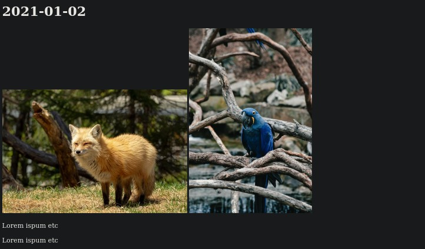

# Joto

Generate a photo journal from ingested images and text that are stored in an SQLite db.



## Requirements

* git
* minimum Python 3.9
* sqlite3
* ImageMagick - compressing images

## Installation

Clone repository: 

```git clone https://github.com/un-term/joto```

Change into source directory:

```cd joto/```

Setup folders and SQLite db (in source directory):

``` python3 joto.py --create-req ```

## How to use 

### Adding image files

Images must have the date first in this format: `YYYY-MM-DD_name_.ext`

Allowed extensions: "jpg","JPG","jpeg","JPEG","png","PNG"

``` python3 joto.py --scan folder_path ```

### Adding text only

``` python3 joto.py --text ```

### Additional options

``` python3 joto.py --help  ```

### Viewing photo journal

Open `joto.html` in web browser.
